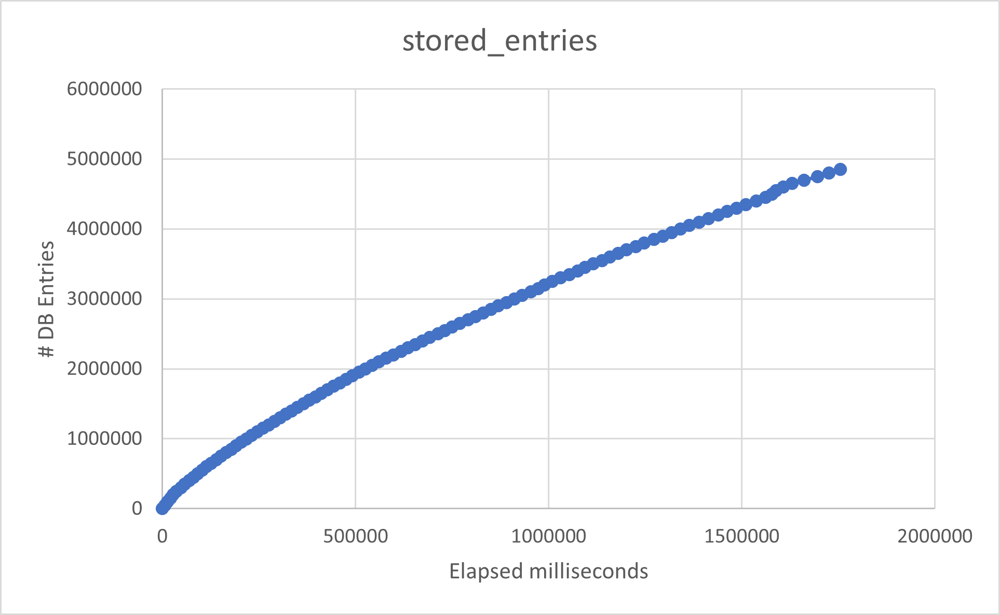

# Task 01 Informationssysteme (Piepmeyer)

Link to repository: https://github.com/Bassadin/Informationssysteme-INM2/tree/main/Task_01

## Initial Measurements (16.10.22 20:00)

## Measurements with references and FK checks

## H2 Client-Server Mode

Used h2 docker container for
server: ` docker run -d -p 1521:1521 -p 81:81 -v /var/lib/docker/volumes/h2_data/_data:/opt/h2-data -e H2_OPTIONS=-ifNotExists --name=H2_Database_Server oscarfonts/h2`.

IfNotExists option is important because no tables can be created otherwise.

Web interface then available on http://localhost:81/.

DB Connection in Java can be achieved with `DriverManager.getConnection("jdbc:h2:tcp://localhost:1521/demo_db");`.

For some reason, the client server mode seems _way_ slower than in-file even though the docker volume for the db server is also on my SSD.

## Ideas for future improvements

- Maybe handle the db instructions and line readings via threads?
- How to measure bottlenecks?
- Why aren't `MERGE INTO KEY(pk)` or `REPLACE INTO` or `INSERT IGNORE` speeding up things? 